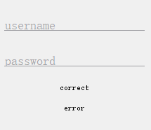

Qt-标签输入框
===

一个带有标签动画、焦点动画、正确提示、错误警告的单行输入框控件。


## 截图




## 使用

1. 把`labedled_edit`文件夹放入Qt工程
2. 这只是一个对`QLineEdit`的包装，通过`setLabelText(QString)`设置标签文字，以及通过`edit()`获取`QLineEdit`对象，所有修改操作都是针对编辑框了，不需要额外操作


## 代码

```C++
#include "LabeledEdit"

// 创建对象
LabeledEdit* le = new LabeledEdit("password", this);

// 显示动画
if (le->edit()->text() == "true")
    le->showCorrect(); // 正确的勾
else
    le->showWrong(); // 错误的波浪线

le->showLoading(); // 开启加载动画
le->hideLoading(); // 关闭加载动画（在调用 showCorrect/showWrong 时会自动 hide）
le->showWrong("请输入正确的xxx"); // 波浪错误动画+文字提示
le->showWrong("密码错误", true); // 参数二：用户编辑文字后，是否自动清除掉错误提示

le->setLabelText("用户名"); // 上面的标签文字
le->setTipText("4~16位字母/数字"); // 鼠标悬浮时提示
le->setAccentColor(Qt::red);
```


## 注意事项

如果多个输入框一起，可能看起来会比较分散，建议把外部layout的`spacing`设置为0。

若不需要错误波浪线`showWrong()`，可以把上下两个space控件高度改为0


## 小细节

- 全局非线性动画
- Label每个字符的动画先后、动画距离都不一样
- 正确动画中，勾原先的弹动横线长度 = 圆弧弧长 = 显示一部分勾的弧长+一部分勾长 = 勾的右线条长
- 错误动画带有延迟，更像波浪从右往左传播
- 字符就算在动画中都可以实时编辑
